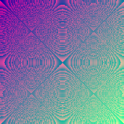

<div align="center">
  

  
# hsDummmyImage


  
### Generate image with target size for testing & more!  
  
</div>

<summary><h2 style="display: inline-block;">🌟 About</h2></summary>

This is a small utility written in Haskell for generating images with a certain size.<br>
Developed for the needs of testing.<br>
It was originally written in Python.

<summary><h2 style="display: inline-block;">⚡ Futures</h2></summary>

 * Generate PNG images with target size
 * Parallel processing
 * Scaling images (same images with deferent sizes)
 
 > If you need more formats -> open an Issue <br>
 > Have interesting ideas for generator functions -> welcome to PR!

<summary><h2 style="display: inline-block;">💻 Usage</h2></summary>

Go to [release page](https://github.com/DummyFiles/hsDummyImage/releases) and get binary for your platform

```
hsDummyImage - tool for generating images with target file size

Usage: hsDummyImage*  [-s|--size SIZE] [-u|--units {b, kb, mb, gb}]
                      [-o|--output NAME] [-d|--output-dir PATH]
                      [-f|--gen-func GEN_FUNC] [--dump-func-list]

Available options:
  -s,--size SIZE           Target size for dummy in UNITS (default: 100)
  -u,--units {b, kb, mb, gb}
                           One of {b, kb, mb, gb} (default: "kb")
  -o,--output NAME         ⁽¹⁾Output name (default: "dummy_%v_%v.png")
  -d,--output-dir PATH     Output dir (default: "./")
  -f,--gen-func GEN_FUNC   The function to generate. Available -> {stains |
                           fastest_mono | alt_stains | matrix | cold_grid |
                           high_crosswalk} (default: "stains")
  --dump-func-list         List available functions and exit
  -h,--help                Show this help text
  
For example:
> hsDummyImage.exe -s 204 -u mb -f matrix
```
\[1] The output name can contain either exactly two placeholders (%v) or none. The placeholders will be replaced by the size and units of measurement, respectively.

<summary><h2 style="display: inline-block;">🗜️ Functions List</h2></summary>

<br>

| NAME | SCALE | SPEED | IMAGE |
| :--- | :---: | :---: | :---: |
| [`stains`](docs/available_functions.md#stains) | ✔ | 🟢 | <a href="docs/available_functions.md#stains"></a> |
| [`hypnotoad`](docs/available_functions.md#hypnotoad) | ✔ | 🟢 | <a href="docs/available_functions.md#hypnotoad"></a> |
| [`fastest_mono`](docs/available_functions.md#fastest_mono) | ✔ | 🟢 | <a href="docs/available_functions.md#fastest_mono"></a> |
| [`alt_stains`](docs/available_functions.md#alt_stains) | ✔ | 🟡 | <a href="docs/available_functions.md#alt_stains"></a> |
| [`matrix`](docs/available_functions.md#matrix) | ✔ | 🟢 | <a href="docs/available_functions.md#matrix"></a> |
| [`cold_grid`](docs/available_functions.md#cold_grid) | ✔ | 🟠 | <a href="docs/available_functions.md#cold_grid"></a> |
| [`high_crosswalk`](docs/available_functions.md#high_crosswalk) | ✖ | 🟢 | <a href="docs/available_functions.md#high_crosswalk"></a> |

<summary><h2 style="display: inline-block;">🔗 Links</h2></summary>

* [_perfomanceTester](https://github.com/DummyFiles/_perfomanceTester)


