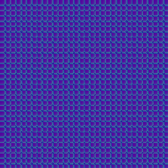

## Summary

| NAME | SCALE | SPEED | IMAGE |
| :--- | :---: | :---: | :---: |
| [`stains`](#stains) | ✔ | 🟢 |  |
| [`hypnotoad`](#hypnotoad) | ✔ | 🟢 |  |
| [`fastest_mono`](#fastest_mono) | ✔ | 🟢 |  |
| [`alt_stains`](#alt_stains) | ✔ | 🟡 |  |
| [`matrix`](#matrix) | ✔ | 🟢 |  |
| [`cold_grid`](#cold_grid) | ✔ | 🟠 |  |
| [`high_crosswalk`](#high_crosswalk) | ✖ | 🟢 |  |

## 📈 Benchmarks

> Below are the average results of 30 [tests](https://github.com/DummyFiles/_perfomanceTester). 
> The accuracy of the measurements is debatable, 
> but this is quite enough to compare the functions with each other.

<b>1-cores</b>

> ##### Runner hardware:
> * 🏿 1-x CPU cores
> * 💾 Disk drive write speed: 326.433MiB/s

| Names | 1 kb | 128 kb | 512 kb | 1 mb | 16 mb | 128 mb | Total |
| --- |:---: | :---: | :---: | :---: | :---: | :---: | ---: |
| `fastest_mono` | 0.001394 | 0.004598 | 0.01005 | 0.01655 | 0.2486 | 2.131 | 2.412 |
| `high_crosswalk` | 0.00138 | 0.005172 | 0.01352 | 0.0249 | 0.38 | 3.169 | 3.594 |
| `hypnotoad` | 0.001392 | 0.005976 | 0.01538 | 0.02889 | 0.4375 | 3.638 | 4.127 |
| `matrix` | 0.001396 | 0.006844 | 0.01933 | 0.03526 | 0.4764 | 3.81 | 4.349 |
| `stains` | 0.001392 | 0.006054 | 0.01708 | 0.03213 | 0.4953 | 4.101 | 4.653 |
| `alt_stains` | 0.001424 | 0.00716 | 0.02185 | 0.04173 | 0.6509 | 5.352 | 6.075 |
| `cold_grid` | 0.001572 | 0.02071 | 0.07463 | 0.1444 | 2.225 | 7.394 | 9.861 |

<b>2-cores</b>

> ##### Runner hardware:
> * 🏿 2-x CPU cores
> * 💾 Disk drive write speed: 275.281MiB/s

| Names | 1 kb | 128 kb | 512 kb | 1 mb | 16 mb | 128 mb | Total |
| --- |:---: | :---: | :---: | :---: | :---: | :---: | ---: |
| `cold_grid` | 0.001264 | 0.01386 | 0.04316 | 0.08396 | 1.297 | 0.2322 | 1.672 |
| `fastest_mono` | 0.00118 | 0.003296 | 0.007152 | 0.01236 | 0.1863 | 1.608 | 1.819 |
| `high_crosswalk` | 0.0012 | 0.00392 | 0.009368 | 0.01674 | 0.2525 | 2.143 | 2.426 |
| `hypnotoad` | 0.001202 | 0.004732 | 0.01077 | 0.01965 | 0.2822 | 2.381 | 2.7 |
| `matrix` | 0.001198 | 0.005948 | 0.01284 | 0.02348 | 0.3026 | 2.464 | 2.81 |
| `stains` | 0.004018 | 0.004778 | 0.0114 | 0.02098 | 0.3119 | 2.615 | 2.968 |
| `alt_stains` | 0.001198 | 0.005572 | 0.01403 | 0.0259 | 0.3915 | 3.256 | 3.694 |

<b>8-cores</b>

> ##### Runner hardware:
> * 🏿 8-x CPU cores
> * 💾 Disk drive write speed: 332.725MiB/s

| Names | 1 kb | 128 kb | 512 kb | 1 mb | 16 mb | 128 mb | Total |
| --- |:---: | :---: | :---: | :---: | :---: | :---: | ---: |
| `fastest_mono` | 0.00147 | 0.003712 | 0.007038 | 0.01023 | 0.1398 | 1.241 | 1.403 |
| `high_crosswalk` | 0.00146 | 0.003754 | 0.00755 | 0.01173 | 0.1615 | 1.4 | 1.586 |
| `hypnotoad` | 0.001478 | 0.003614 | 0.007582 | 0.01197 | 0.1666 | 1.463 | 1.654 |
| `matrix` | 0.001474 | 0.003746 | 0.008026 | 0.01258 | 0.1718 | 1.477 | 1.674 |
| `stains` | 0.001504 | 0.003642 | 0.007912 | 0.01247 | 0.175 | 1.525 | 1.726 |
| `alt_stains` | 0.00146 | 0.00476 | 0.008646 | 0.01415 | 0.1981 | 1.7 | 1.927 |
| `cold_grid` | 0.001446 | 0.006434 | 0.01618 | 0.03039 | 0.4541 | 3.693 | 4.202 |

## ☔ Functions

### `stains`

| **8 kB** | **64 kB** | **128 kB** | **512 kB** |
| :---: | :---: | :---: | :---: |
|  |  |  |  |
| _52x52_ | _147x147_ | _209x209_ | _418x418_ |
  

### `hypnotoad`

| **8 kB** | **64 kB** | **128 kB** | **512 kB** |
| :---: | :---: | :---: | :---: |
|  |  |  |  |
| _52x52_ | _147x147_ | _209x209_ | _418x418_ |
  

### `fastest_mono`

| **1 kB** |
| :---: |
|  |
| _18x18_ |
  

### `alt_stains`

| **8 kB** | **64 kB** | **128 kB** | **512 kB** |
| :---: | :---: | :---: | :---: |
|  |  |  |  |
| _52x52_ | _147x147_ | _209x209_ | _418x418_ |
  

### `matrix`

| **8 kB** | **64 kB** | **128 kB** | **512 kB** |
| :---: | :---: | :---: | :---: |
|  |  |  |  |
| _52x52_ | _147x147_ | _209x209_ | _418x418_ |
  

### `cold_grid`

| **8 kB** | **64 kB** | **128 kB** | **512 kB** |
| :---: | :---: | :---: | :---: |
|  |  |  |  |
| _52x52_ | _147x147_ | _209x209_ | _418x418_ |
  

### `high_crosswalk`

| **8 kB** | **64 kB** | **128 kB** | **512 kB** |
| :---: | :---: | :---: | :---: |
|  |  |  |  |
| _52x52_ | _147x147_ | _209x209_ | _418x418_ |
  

